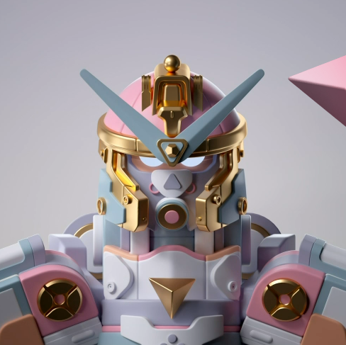

# MekaVerse / ETH

## 项目官网

https://www.themekaverse.com/

## 项目性质及简介

Art

The MekaVerse is a collection of 8,888 generative Mekas with hundreds of elements inspired by the Japan Mecha universes.

https://en.wikipedia.org/wiki/Mecha

说人话就是 8,888 个机甲(也叫高达？) NFT 。。。

## 项目 Twitter

https://twitter.com/MekaVerse

## 项目 Discord

https://discord.gg/mekaverse

## 项目白名单

无

## 其余社交媒体链接

Reddit → https://www.reddit.com/r/MekaVerse/
Twitch → https://www.twitch.tv/themekaverse
Instagram: https://instagram.com/themekaverse

## 项目 Pre-sale 信息

LAUNCH DATE
If all goes as planned, we will be launching around September 25th - 30th

尚未完全确定时间。

MINT PRICE
We plan to set a mint price of 0.2 ETH

价格 ：预计 0.2 ETH

数量 : 8,888

## 项目发行方资料

Mattey

https://twitter.com/Matteyy_
https://www.instagram.com/matteyyy_/?hl=fr
https://lynkfire.com/Mattey

Ins 关注人数 46k Twitter 19k

Matt.B

https://twitter.com/MattBraccini
https://www.instagram.com/matthieubraccini
https://lynkfire.com/Matt_b

Ins 关注人数 32k Twitter 21k

## 项目初始发掘位置

Twitter

## 项目总体评分

1. 人气值

   2021.9.16

总社区人数 8w 左右 Twitter 8.4w Discord 8.1w

Reddit,Twitch 600+

Instagram 3800+

此项暂定 95

2. 活跃度

Twitter 讨论热度相较于总体关注人数而言偏低。

Discord 总体讨论热度较高，社群来自世界各地，主要讨论人群集中于北美与亚太地区，欧洲人群参与度不高。

此项暂定 80

3. 稀有度

项目非常有出圈潜力，总发行量中规中矩。

产品有历史文化基础，受众面广泛，集中于亚太地区，市场接受度高。

此项暂定 85

4. 项目方

受欢迎程度高，作者影响力超群。

此项暂定 95

5. 应用价值

根据项目官网 Roadmap,可能会推出交互式 NFT,应用价值较高。

此项暂定 80

## 总评

根据权重计算总分

95*30%+80*30%+85*15%+95*15%+80\*10%= 87.5
